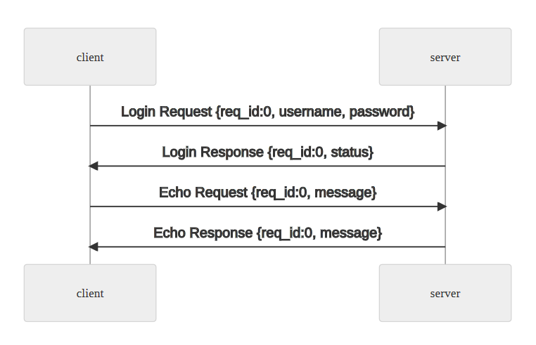

# TCP Echo Server
The purpose of this project is to establish secure communication using the Linear Congruential Generator (LCG) cipher algorithm over a TCP protocol between a client and a server. In the first stage, the client sends login data to the server, which verifies if both fields are filled, granting permission for the client to proceed with the connection. The second stage involves message exchange, where the client reads user input, encrypts the text using the LCG key, and sends it to the server. The server then decrypts the message and forwards it back to the client. This process ensures secure and effective communication between the involved parties.

# How to build

### Config .env file
> Add a .env file inside requirements directory and set values with the above values.

        SERVER_ADDR=<server address>
        SERVER_PORT=<server port>

### Build with make

**To build and run the project, execute the following command:**
```
make
```

**Another commands**

To build the project, use:
```
make build
```

To start containers, run:
```
make up
```

To stop containers, execute:
```
make down
```

To clean up running containers:
```
make clean-p
```

To remove container images:
```
make clean-i
```

To clean up the entire project (containers and images):
```
make fclean
```

To clean and rebuild the project:
```
make re
```

### Running a client

To run a client, simply open a terminal and execute the following commands:
```
make client
./client $SERVER_ADDR $SERVER_PORT <username> <password>
```

# Improvement Points
- Introduce a base class with generic server and client methods, applying inheritance concepts.
- Implement a pseudo-random function to generate more robust login sequences.
- Adopt socket multiplexing to optimize communication.
- Create unit tests to ensure code robustness.
- Develop load tests to evaluate performance under extreme conditions.
- Conduct end-to-end tests to verify the complete system integration.
- Enhance message splitting logic to efficiently handle the transmission of large messages.
- Address memory leaks identified in the exception class.


# Problem Description



1. The client will send a login Requesst initially.
2. The server will check if the login as following:
    a. if a username and password is valid send a login Response with status code OK.
    b. Else, send a Login Response with status code FAILED, and disconnect client.
3. Handling of echo requesst:
    a. The client will send Echo Request with variable sized ciphered message.
    b. The server shall get message in the Echo Request and decipher it and then send to as Echo Response.

### Username and Password Validation
> Any username and password are valid.

### Decryption of Echo Request Message

1. Calculate the checksumm (sum complement) of username using an uint8_t counter.
2. Calculate the checksum (sum complement) of password using an uint8_t counter.
3. The initial_key would be (message_sequence << 16) | (username_sum << 8)
password_sum

| 24...16 | 15...8 | 7...0 |
| ------- | ------ | ----- |
| message_sequence | username | password |

4. The generation of cipher key will done using this LCG variant (only for this purpose):

```C++
    uint32_t next_key(uint32_t key) {
        return (key * 1103515245 + 12345) % 0x7FFFFFFF;
    }
```

5. To generate a cipher key, you need to take the mod 256 of the state value:

```c++
    key0 = next_key(initial_key); // cipher_key[0] = key0 % 256;
    key1 = next_key(key0); // cipher_key[1] = key1 % 256;
    key2 = next_key(key1); // cipher_key[2] = key2 % 256;
    keyN = next(keyN_minus_1); // cipher_key[N] = keyN % 256
```

Example set of cipher key:

**IN**
| label | value |
| ----- | ----- |
| username | testuser |
| password | testpass |
| message_sequence | 87 |

**OUT**
| label | value |
| ----- | ----- |
| initial_value | 0x577F77 |
| cipher_key (first 64 bytes) | E5 BA 6B C9 CE EF FC 86 48 E1 06 C8 62 F3 B1 96 <br> 18 72 C4 AD E2 74 9D 13 51 B7 24 8E B0 2A 1B B9 <br> FE 60 19 DF 2D 62 F4 1E FF CC 16 98 F2 44 2E CF <br> 5D D2 A4 0E 30 A9 2F 3D 32 83 01 A6 E7 95 AB 09 <br> 0E 30 A9 2F 3D 32 83 00 3A EC B6 B8 91 F7 65 3A |

6. To generate the plain text from the cipher text you just have to xor cipher text and cipher key.

### Interface Definition

**Header**

| offset | size | type | name |
| ------ | ---- | ---- | ---- |
| 0 | 2 | unsigned | Message Size (including the header) |
| 2 | 1 | unsigned | Message Type |
| 3 | 1 | unsigned | Message Sequence |

The response message should contain the same message sequence as the request message.

### Login Request (type=0)

| offset | size | type | name |
| ------ | ---- | ---- | ---- |
| 0 | 4 | struct | Header |
| 4 | 32 | asciiz | Username |
| 36 | 32 | asciiz | Password |

Username and Password are fixed length, unused space are padded with NULL (0).

### Login Response (type=1)

| offset | size | type | name |
| ------ | ---- | ---- | ---- |
| 0 | 4 | struct | Header |
| 4 | 2 | unsigned | Status Codde {0=FAILED, 1=OK} |

In this purpose OK is only valid Status Code.

### Echo Request (type=2)

| offset | size | type | name |
| ------ | ---- | ---- | ---- |
| 0 | 4 | struct | Header |
| 4 | 2 | unsigned | Message Size |
| 6 | Variable | binary | Cipher Message |

Cipher Message length is determined by the Message Size.

### Echo Response (type=3)

| offset | size | type | name |
| ------ | ---- | ---- | ---- |
| 0 | 4 | struct | Header |
| 4 | 2 | unsigned | Message Size |
| 6 | Variable | binary | Plain Message |

Plain Message length is determined by the Message Size.

### Scoring 
> The scoring will be based on completeness, particularly on:

- Client Handling
    - Proper frame detection
    - Concurrrent client support (Bonus)
    - IO socket multiplexing (Bonus)
- Message Serialization/Deserialization
- Message Handling
    - Login Request
    - Echo Request
- Decryption (Bonus)
    - in case of omitting, send the Echo Request cipher message as plain message in Echo Response.